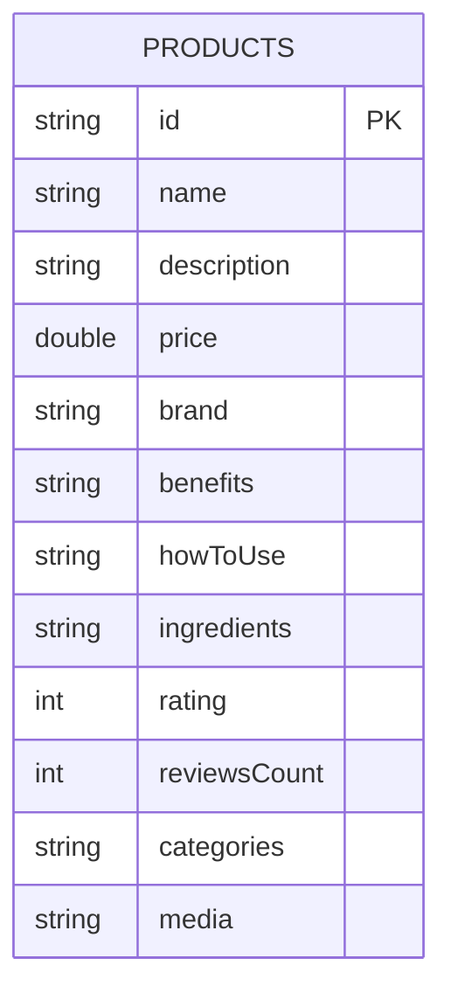

# DESIGN.md

## 1. Overview

This document outlines the design for "La Bonne Sante," a Flutter e-commerce application for pharmacy products. The app will provide users with a seamless browsing experience, featuring an offline-first approach to ensure functionality even with intermittent network connectivity.

The initial version of the app will focus on two main pages: a home/product list page and a product detail page. It will use a dummy REST API for product data.

## 2. Detailed Analysis of the Goal or Problem

The primary goal is to build a performant and user-friendly mobile application for browsing and purchasing pharmacy products. The key challenges and requirements are:

*   **Offline-first:** The app must be usable without a network connection. Data should be cached locally, and the UI should reflect the cached data.
*   **State Management:** A robust state management solution is needed to handle the app's state, including product lists, categories, banners, and the shopping cart.
*   **Data Persistence:** A local database is required to store product data for offline access.
*   **Networking:** A reliable networking layer is needed to communicate with the REST API.

*   **Architecture:** The app should follow a clean, scalable, and maintainable architecture, such as a simplified Domain-Driven Design (DDD).

## 3. Alternatives Considered

### State Management

*   **Provider:** A popular and simple state management solution. However, for a more complex app with offline-first requirements, a more powerful solution like Riverpod is better suited due to its compile-safe providers and easier dependency injection.
*   **BLoC:** A powerful and mature state management library. However, it can be more verbose than Riverpod and has a steeper learning curve. For this project, Riverpod offers a good balance of power and simplicity.

### Local Database

*   **sqflite:** A raw SQLite plugin for Flutter. It provides a lot of control but requires writing a lot of boilerplate code for CRUD operations.
*   **Hive:** A lightweight and fast key-value database. It's a good choice for simple data storage, but for relational data like products and categories, a more structured solution like Drift is preferable.

## 4. Detailed Design

### 4.1. Architecture

We will adopt a simplified Domain-Driven Design (DDD) approach, organizing the project by features. The main layers will be:

*   **Presentation:** Contains the UI (widgets and screens) and state management (Riverpod notifiers).
*   **Domain:** Contains the core business logic, entities, and repository interfaces. This layer is independent of any framework.
*   **Data:** Implements the repository interfaces from the domain layer and handles data fetching from remote (API) and local (Drift database) sources.
*   **Core:** Contains shared code, such as constants, dependency injection, and utility functions.

The project structure will look like this:

```
lib/
├── core/
│   ├── api/
│   ├── db/
│   └── ...
├── features/
│   ├── products/
│   │   ├── data/
│   │   │   ├── datasources/
│   │   │   ├── models/
│   │   │   └── repositories/
│   │   ├── domain/
│   │   │   ├── entities/
│   │   │   ├── repositories/
│   │   │   └── usecases/
│   │   └── presentation/
│   │       ├── notifiers/
│   │       ├── pages/
│   │       └── widgets/
│   └── ...
└── main.dart
```

### 4.2. Data Layer

#### 4.2.1. Local Database (Drift)

We will use Drift for local data persistence. The database schema will be designed to cache products. To keep the structure simple, we will use a single table for products and store categories and images as a list of strings using a `TypeConverter`.



#### 4.2.2. Remote API (Dio)

We will use the Dio library for making HTTP requests to the REST API. A `DioClient` class will be created to handle the base URL, headers, and error handling.

The API endpoints are:
*   `https://68f0f2750b966ad50034d024.mockapi.io/api/v1/products` (for product lists)
*   `https://68f0f2750b966ad50034d024.mockapi.io/api/v1/products/:id` (for product details)

Banners and categories will be mocked at the remote data source level.

### 4.3. Domain Layer

The domain layer will contain the core business logic and entities.

*   **Entities:** Plain Dart objects representing the core business models (e.g., `Product`, `Category`).
*   **Repositories:** Abstract interfaces for the data layer to implement (e.g., `ProductRepository`).
*   **Usecases:** Classes that encapsulate a single business operation (e.g., `GetProducts`, `GetProductDetails`).

### 4.4. Presentation Layer

The presentation layer will be built with Flutter and will use Riverpod for state management.

*   **Home Page:**
    *   Displays a promotional banner carousel.
    *   Displays a list of product categories.
    *   Displays two sections of products: "Trending Now" and "Special Offers".
    *   Each product will have a name, image, and price.
    *   Tapping on a product will navigate to the product detail page.
*   **Product Detail Page:**
    *   Displays the product image, title, subtitle, rating, review count, description, and price.
    *   Includes an "Add to Cart" button and a quantity selector.
    *   Shows a "Frequently Bought Together" section with other products.

### 4.5. State Management (Riverpod)

We will use a combination of Riverpod providers to manage the app's state:

*   **`FutureProvider`:** For fetching data that doesn't change often, like the product categories and banners.
*   **`StateNotifierProvider`:** For managing the state of the product lists and the shopping cart.
*   **`Provider`:** For providing dependencies, such as the `ProductRepository`.

### 4.6. Offline-First Strategy

The offline-first strategy will be implemented as follows:

1.  **Data Fetching:** The repository will first try to fetch data from the local Drift database.
2.  **UI Display:** The UI will immediately display the cached data.
3.  **Network Request:** In the background, the repository will make a network request to fetch the latest data from the API.
4.  **Cache Update:** If the network request is successful, the local database will be updated with the new data.
5.  **UI Refresh:** The UI will automatically refresh to display the latest data from the database.

### 4.7. Internationalization (i18n)

The app uses Flutter's gen-l10n for localization. Strings are defined in `lib/l10n/app_en.arb` and exposed via `AppLocalizations` with a `BuildContext` extension `context.l10n`.

- Error placeholders and actions are localized:
  - **Retry**: `retry`
  - **Banners error**: `bannersErrorMessage`
  - **Categories title**: `categoriesTitle`
  - **Categories error**: `categoriesErrorMessage`
  - **Products error**: `productsErrorMessage`

### 4.8. Error Handling UX

Each section shows a friendly, consistent placeholder on error using `SectionErrorPlaceholder` with optional retry:

- Banners: title `appTitle`, message `bannersErrorMessage`, retry refreshes `bannersProvider`.
- Categories: title `categoriesTitle`, message `categoriesErrorMessage`, retry refreshes `categoriesProvider`.
- Special Offers and Trending Now: title `specialOffersTitle`/`trendingNowTitle`, message `productsErrorMessage`, retry triggers `getProducts()`.

If the network request fails, the app will continue to function with the cached data.